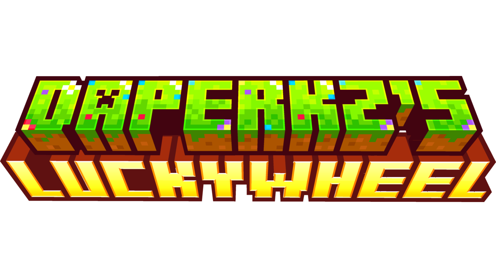

[](https://gradle.org/)
[](https://papermc.io)
[](https://purpurmc.org)
[](https://papermc.io/software/folia)
[](https://www.oracle.com/java/)
[](https://opensource.org/licenses/MIT)

---

## 📖 About

Most reward wheel and loot crate plugins feel rigid, outdated, or hard to customize. They force standard layouts, lack real fluid animations, or risk item duping and exploits through weak item handling.

**Daperkz's LuckyWheel** was created to change that. It brings a polished, casino-style sliding GUI animation to Paper, Purpur, and Folia servers while placing complete customizability and security in your hands.

The project publishes one JAR per supported Minecraft/Paper API version: `1.20.6`, `1.21`, `1.21.1`, `1.21.4`, `26.1`, `26.2`, and `26.3` (alpha). Use the JAR matching the server version.

---

## ⚡ Key Features

- **Animated GUI Wheel Engine**: Fluid horizontal sliding inventory GUI animation featuring dynamic tick delays, smooth slowdown physics, custom tick sounds, and precision winning slot calculation.
- **Secure NBT/PDC Ticket Verification**: Tickets are cryptographically tagged with `PersistentDataContainer` (PDC) data storing `wheel_ticket` and the player's unique `owner` UUID. Tickets cannot be forged, duplicated, or used by unauthorized players.
- **Weighted Chance System**: Advanced probability engine supporting granular weights, from high-frequency common drops to ultra-rare 0.001% jackpot rewards.
- **Multi-Wheel Architecture**: Create unlimited separate wheel configurations (e.g., `Daily.yml`, `VIP.yml`, `Event.yml`) stored modularly under `plugins/LuckyWheel/wheels/`.
- **Dynamic Rewards & Holograms**: Deliver physical items, trigger win sound effects, display custom lore/holograms, or execute console commands dynamically using the `%player%` placeholder.
- **Native Folia Multi-Threading**: Fully compatible with Folia region-based execution using `getGlobalRegionScheduler()` for command execution and entity-scheduled inventory animations.

---

## 🚀 Quick Start & Installation

1. **Download** the JAR matching your server, for example `LuckyWheel-26.2-1.2.3.jar`.
2. Place the `.jar` file into your server's `/plugins/` directory.
3. Restart your server to generate default files and the default `wheels/Daily.yml` wheel.
4. Issue a ticket to yourself using `/luckywheel give Daily <your_name> 1`.
5. Hold the ticket in your hand and **Right-Click** (or run `/luckywheel spin Daily`) to start the wheel!

---

## 🎮 Commands & Permissions

| Command | Description | Default Permission |
| :--- | :--- | :--- |
| `/luckywheel spin <wheel>` | Consumes 1 held ticket and triggers the wheel spin GUI. | `Daperkz.luckywheel` *(True)* |
| `/luckywheel give <wheel> [player] [qty] [prize_id]` | Grants bound, secure PDC tickets to a target player. | `Daperkz.luckywheel.admin` *(OP)* |
| `/luckywheel reload` | Reloads main config and all custom wheel YML files instantly. | `Daperkz.luckywheel.admin` *(OP)* |

*Shortcut Alias:* `/lw`

## 🛠️ Building From Source

The project uses the Gradle Wrapper and Kotlin DSL. The Makefile provisions a project-local Eclipse Temurin JDK when the required JDK is not installed.

```bash
# Build one JAR for every configured Minecraft version
make jar

# Build only selected versions
make jar PAPER_VERSIONS="1.21,1.21.4"

# Clean generated output
make clean
```

JARs are written to `build/libs/`. Minecraft `1.20.x` and `1.21.x` targets use Java 21 bytecode; Minecraft `26.x` targets use Java 25 bytecode. The default build therefore provisions Java 25 automatically. The `26.3` target currently uses an alpha Paper API.

---

## ⚙️ Configuration Setup

`Daperkz's LuckyWheel` allows you to define infinite modular wheel files inside the `plugins/LuckyWheel/wheels/` folder. Here is an example setup (`Daily.yml`):

```yaml
settings:
  slots: 16
  rotation: CLOCKWISE
  total-ticks: 55
  animation-speed: 1
  slowdown-ticks: 2
  start-delay-ticks: 30
  winning-slot: 5

sounds:
  open: "BLOCK_CHEST_OPEN"
  spin: "BLOCK_NOTE_BLOCK_PLING"
  win_default: "ENTITY_EXPERIENCE_ORB_PICKUP"

ticket:
  material: PAPER
  name: "&6Lucky Wheel Ticket"
  lore:
    - "&d&lClique Gauche Pour Tourner la Roue!"
    - "&fBonne Chance!"
  custom-model-data: 0

prizes:
  prize1:
    material: ENCHANTED_GOLDEN_APPLE
    quantity: 1
    chance: 1000 # 0.1% chance weight
    sound: "ENTITY_PLAYER_LEVELUP"
  prize2:
    material: PAPER
    quantity: 1
    chance: 50000
    hologram: ["&d&lReroll Ticket", "&fUn nouveau ticket!"]
    commands: ["lw give Daily %player% 1 prize2"]
  prize3:
    material: BARRIER
    quantity: 1
    chance: 100000
    hologram: ["&c&lRien du tout", "&7Dommage..."]
    commands: ["say %player% a perdu!"]
    sound: "ENTITY_VILLAGER_NO"
```

---

## ❓ Frequently Asked Questions

### Can players steal items out of the spinning wheel GUI?
No. The plugin intercepts all inventory interactions and cancels click events in real-time, locking down the items until the animation concludes and rewards are properly distributed.

### Can tickets be forged using renamed paper or custom item plugins?
No. Each ticket generated via `/luckywheel give` embeds hidden server-side `PersistentDataContainer` (PDC) tags containing the targeted wheel key and the player's explicit UUID. Un-tagged or forged items will be rejected immediately.

### Is Folia natively supported?
Yes. Daperkz's LuckyWheel detects Folia environments at runtime and handles scheduled ticks via player and global region schedulers, preventing cross-region threading issues.

---

## 🛠️ Developer Information & Repository

Looking to contribute, inspect the class architecture, or build the project from source?

- 📦 **GitHub Repository:** [Daperkz/LuckyWheel](https://github.com/Daperkz/LuckyWheel)
- 📖 **Developer Guide:** [Developer README (README_DEV.md)](https://github.com/Daperkz/LuckyWheel/blob/main/README_DEV.md) for build instructions, internal class references, and multi-threading guidelines.
- 🐛 **Issue Tracker:** Report bugs or request features on the [GitHub Issues](https://github.com/Daperkz/LuckyWheel/issues) page.

---

## 📄 License

Distributed under the **MIT License**. See [`LICENSE`](./LICENSE) for details.
